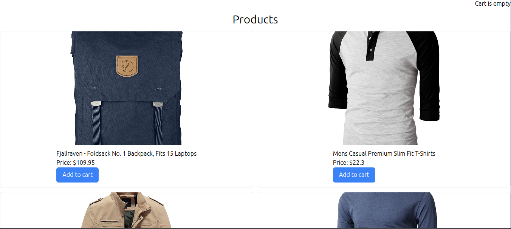
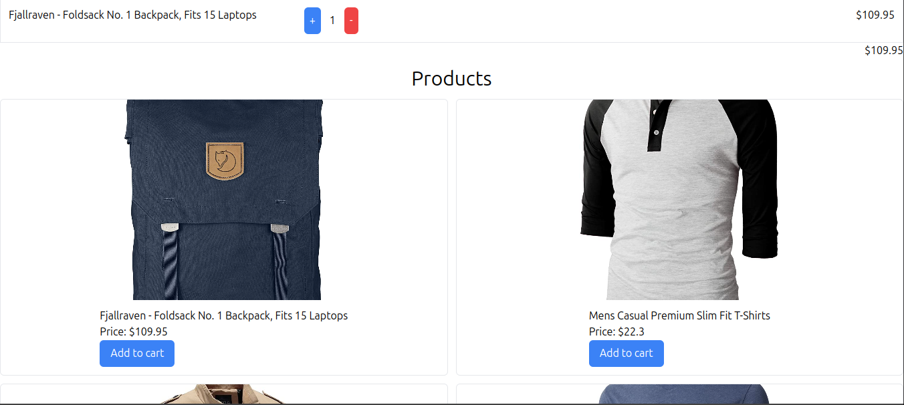
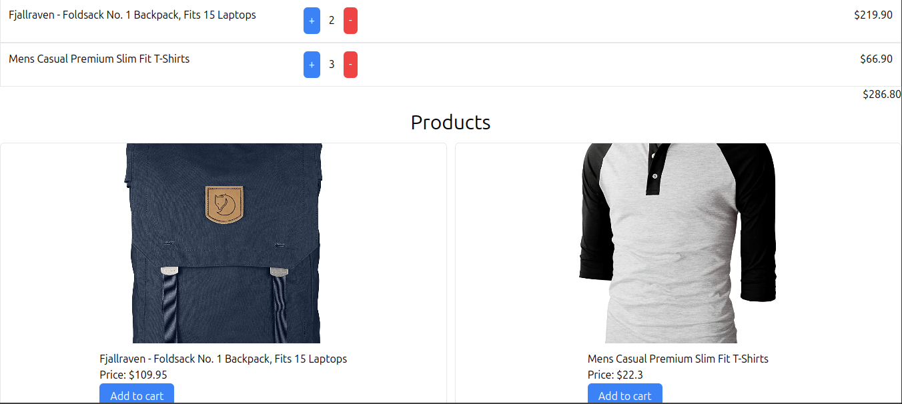

# Descripción del Repositorio
- Este repositorio contiene un pequeño proyecto de un ecommerce de venta de productos en el cual consumimos una API externa para traer los productos, agregamos dichos productos seleccionados
por el usuario a un carrito de compras que almacena toda la informacion en el Local Storage del navegador, los productos pueden aumentar, disminuir o desaparecer del carrito segun la voluntad del usuario, su valor puede restarse o sumarse y generar un gran total.
- Para la realizacion de este proyecto se utilizaron las siguientes tecnologias:
  - [Html](https://developer.mozilla.org/es/docs/Web/HTML): Lenguaje de marcado para esrtuctura basica del proyecto en la web.
  - [Css](https://developer.mozilla.org/es/docs/Web/CSS): Lenguaje de estilos para dar presentacion al proyecto web.
  - [Tailwind Css](https://tailwindcss.com/): Framework de CSS de código abierto​ para el diseño de la parte visual del proyecto web.
  - [Javascript](https://developer.mozilla.org/es/docs/Web/javascript): Lenguaje de programación para desarrollo de forntend y Backend.
  - [Typescript](https://www.typescriptlang.org/): Superset de javascript para desarrollo del Backend.
  - [NodeJs](https://nodejs.org/en): Entorno de ejecución de JavaScript multiplataforma, de código abierto y gratuito que permite crear servidores y aplicaciones web.
  - [Vite](https://es.vitejs.dev/): Es una herramienta para Frontend, creada por Evan You, mismo creador de Vuejs, que nos permite crear aplicaciones de Javascript usando algún framework o      libreria como ReactJs, Vuejs, Angular ya sea con algún framework especifico o ya sea Vanillajs.

## Imagenes del juego

